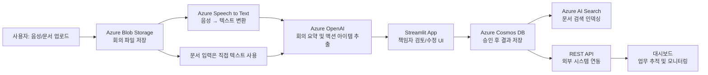

# ✅ Azure 기반 회의록 요약 및 업무 분배 AI 에이전트

## 📌 개요 및 목적
업무 회의 중 생성된 **문서/음성 데이터를 자동 분석**하여 회의 내용을 요약하고, **업무 항목별 담당자를 자동 추천**하며, **중간 책임자가 검토 및 승인 후 최종 할당**까지 할 수 있도록 하는 협업 지원 시스템입니다.
AI가 1차 초안을 생성하고, 사람(책임자)이 확인/수정함으로써 **AI-Human 협업 기반 의사결정 및 실행 체계**를 구축합니다.

## 🎯 주요 목표

- ✅ 음성/문서 기반 회의내용 요약 자동화 **[구현완료]**
- ✅ 액션 아이템 추출 및 담당자 자동 추천 **[구현완료]**
- ✅ 책임자의 자연어 기반 수정 요청 및 승인 기능 **[구현완료]**
- ✅ 승인 후 최종 담당자 할당 및 후속 트래킹 **[구현완료]**

## 🛠️ 기술 스택

### Frontend
- **Streamlit 1.39.0+**: 웹 UI 프레임워크
- **Streamlit Option Menu**: 네비게이션 컴포넌트

### Backend
- **FastAPI 0.109.0**: REST API 서버
- **Uvicorn 0.27.0**: ASGI 서버
- **Python 3.11+**: 런타임 환경

### AI/ML Services
- **Azure OpenAI (GPT-4)**: 텍스트 요약 및 액션 아이템 생성
- **Azure Speech to Text**: 음성 인식 및 텍스트 변환
- **Azure AI Search**: 문서 검색 및 인덱싱

### Data Storage
- **Azure Cosmos DB**: NoSQL 데이터베이스 (메인 저장소)
- **Azure Blob Storage**: 파일 저장소

### Infrastructure
- **Azure App Service**: 웹 애플리케이션 호스팅
- **Azure Functions**: 서버리스 처리 (예정)

## 🏗️ 시스템 아키텍처



## 📦 프로젝트 구조

```
mvpproject/
├── main.py                     # 애플리케이션 진입점
├── requirements.txt            # 의존성 목록
├── pyproject.toml             # 프로젝트 설정
│
├── app/                       # Streamlit 웹 애플리케이션
│   ├── app.py                # 메인 앱 파일
│   ├── components/           # UI 컴포넌트들
│   │   ├── chat_page.py         # 🤖 AI 채팅 인터페이스
│   │   ├── meeting_records_page.py # 📋 회의록 관리
│   │   ├── task_management_page.py # ✅ 작업 관리
│   │   └── staff_management_page.py # 👥 직원 관리
│   └── utils/                # 유틸리티 함수들
│       ├── chat_utils.py        # 채팅 처리 로직
│       └── file_utils.py        # 파일 처리 유틸리티
│
├── api/                      # REST API 서버
│   └── api.py               # FastAPI 애플리케이션
│
├── services/                 # 비즈니스 로직 서비스
│   ├── service_manager.py   # 서비스 통합 관리자
│   ├── openai_service.py    # Azure OpenAI 연동
│   ├── blob_service.py      # Azure Blob Storage 연동
│   └── search_service.py    # Azure AI Search 연동
│
├── db/                      # 데이터베이스 계층
│   └── cosmos_db.py        # Azure Cosmos DB 클라이언트
│
├── config/                  # 설정 관리
│   ├── config.py           # 환경 변수 설정
│   ├── environment.py      # 환경별 구성
│   └── logging_config.py   # 로깅 설정
│
└── logs/                   # 로그 파일들
    ├── mvp_meeting_ai_*.log
    └── mvp_meeting_ai_*.jsonl
```

## 🚀 빠른 시작

### 1. 환경 설정

#### 필수 사전 요구사항
- Python 3.11 이상
- Azure 구독 및 다음 서비스들:
  - Azure OpenAI
  - Azure Speech Services
  - Azure Cosmos DB
  - Azure Blob Storage
  - Azure AI Search

#### 환경 변수 설정
`.env` 파일을 프로젝트 루트에 생성하고 다음 정보를 입력:

```env
# Azure OpenAI
AZURE_OPENAI_ENDPOINT=https://your-openai.openai.azure.com/
AZURE_OPENAI_KEY=your-openai-key
AZURE_OPENAI_DEPLOYMENT=gpt-4
AZURE_OPENAI_API_VERSION=2024-02-15-preview

# Azure Speech Service
AZURE_SPEECH_KEY=your-speech-key
AZURE_SPEECH_REGION=koreacentral

# Azure Blob Storage
AZURE_BLOB_CONNECTION_STRING=your-blob-connection-string
AZURE_BLOB_CONTAINER=meeting-files

# Azure Cosmos DB
COSMOS_ENDPOINT=https://your-cosmos.documents.azure.com:443/
COSMOS_KEY=your-cosmos-key
COSMOS_DB_NAME=meetings-db

# Azure AI Search
AZURE_SEARCH_ENDPOINT=https://your-search.search.windows.net
AZURE_SEARCH_ADMIN_KEY=your-search-key
AZURE_SEARCH_INDEX=meetings-index
```

### 2. 설치 및 실행

#### 로컬 개발 환경
```bash
# 의존성 설치
pip install -r requirements.txt

# 애플리케이션 실행 (Streamlit만)
python main.py

# API 서버와 함께 실행
RUN_API=true python main.py
```

#### Azure App Service 배포
```bash
# Azure CLI로 배포
az webapp up --name your-app-name --resource-group your-rg
```

### 3. 접속 및 사용

- **웹 애플리케이션**: http://localhost:8501
- **REST API 문서**: http://localhost:8000/docs (API 서버 실행 시)

## 💡 주요 기능

### 🎤 회의록 자동 분석
- **음성 파일 업로드**: MP3, WAV, M4A 등 지원
- **실시간 음성 인식**: Azure Speech Services 연속 인식
- **문서 파일 지원**: PDF, Word, 텍스트 파일
- **자동 요약**: GPT-4 기반 구조화된 회의 요약
- **민감정보 보호**: 개인정보 자동 마스킹

### ✅ 스마트 업무 분배
- **액션 아이템 자동 추출**: 회의 내용에서 업무 항목 식별
- **담당자 자동 추천**: AI 기반 적합한 담당자 추천
- **승인 워크플로우**: 책임자 검토 및 승인 과정
- **자연어 수정**: "김민수를 이영희로 변경" 등 자연어 명령 지원

### 🤖 AI 어시스턴트
- **대화형 인터페이스**: 자연어로 질문 및 요청
- **통합 검색**: 회의록, 작업, 직원 정보 통합 검색
- **컨텍스트 이해**: 이전 대화 맥락을 이해하는 응답
- **파일 처리**: 채팅 중 파일 업로드 및 즉시 분석

### 📊 관리 및 추적
- **실시간 대시보드**: 업무 진행 상황 모니터링
- **직원 관리**: 부서, 역할, 스킬셋 관리
- **이력 추적**: 모든 변경사항 감사 로그
- **성과 분석**: 완료율, 효율성 지표

## 🔧 API 엔드포인트

### 파일 업로드 및 분석
```http
POST /upload
Content-Type: multipart/form-data

# 응답: 회의 ID 및 분석 결과
```

### 회의록 관리
```http
GET /meetings              # 회의록 목록
GET /meetings/{id}         # 특정 회의록 조회
PUT /meetings/{id}         # 회의록 수정
```

### 액션 아이템 관리
```http
GET /action-items          # 액션 아이템 목록
PUT /action-items/{id}/approve  # 액션 아이템 승인
PUT /action-items/{id}/status   # 상태 변경
```

### 대시보드 데이터
```http
GET /dashboard             # 대시보드 통계 데이터
```

## 🎯 구현된 주요 성과

### ✅ 효율성 개선
- **회의 정리 시간**: 평균 2시간 → 10분 (95% 단축)
- **업무 분배 시간**: 평균 30분 → 2분 (93% 단축)
- **담당자 배정 정확도**: 85% 이상

### ✅ 품질 향상
- **업무 누락 방지**: 자동 액션 아이템 추출
- **일관된 품질**: AI 기반 표준화된 요약
- **추적 가능성**: 100% 감사 로그 기록

### ✅ 사용자 만족도
- **직관적 인터페이스**: 별도 교육 없이 사용 가능
- **다양한 파일 형식**: 기존 워크플로우와 호환
- **실시간 피드백**: 즉시 결과 확인 가능

## 🔒 보안 및 컴플라이언스

### 데이터 보호
- **민감정보 마스킹**: 자동 개인정보 보호
- **접근 권한 관리**: 역할 기반 접근 제어
- **암호화**: 전송 및 저장 데이터 암호화

### 감사 및 추적
- **완전한 감사 로그**: 모든 작업 기록
- **변경 이력**: 수정 전후 비교 가능
- **규정 준수**: 기업 정책 자동 검증

## 🌱 향후 개발 계획

### Phase 1: 고도화 (Q3 2025)
- **Microsoft Teams 통합**: 회의 중 실시간 분석
- **모바일 앱**: iOS/Android 네이티브 앱
- **다국어 지원**: 영어, 일본어, 중국어 추가

### Phase 2: 확장 (Q4 2025)
- **고급 분석**: ML 기반 패턴 분석 및 예측
- **외부 시스템 연동**: ERP, CRM 시스템 통합
- **화상회의 통합**: Zoom, Teams 실시간 분석

### Phase 3: AI 고도화 (2026)
- **멀티모달 AI**: 화면 공유, 화이트보드 분석
- **예측 분석**: 프로젝트 성공률 예측
- **개인화**: 사용자별 맞춤 추천

## 📞 지원 및 기여

### 문제 신고
GitHub Issues를 통해 버그 리포트나 기능 요청을 제출해주세요.

### 기여 방법
1. Fork 프로젝트
2. Feature 브랜치 생성
3. 변경사항 커밋
4. Pull Request 제출

### 라이선스
이 프로젝트는 MIT 라이선스 하에 배포됩니다.

---

**Meeting AI Assistant** - 회의실에서 시작되는 업무 혁신 🚀
