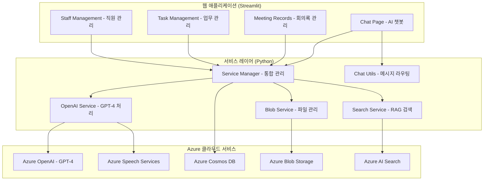

# ✅ Azure 기반 회의록 요약 및 업무 분배 AI 에이전트

## 📌 개요 및 목적
업무 회의 중 생성된 **문서/음성 데이터를 자동 분석**하여 회의 내용을 요약하고, **업무 항목별 담당자를 자동 추천**하며, **중간 책임자가 검토 및 승인 후 최종 할당**까지 할 수 있도록 하는 협업 지원 시스템입니다.

현재 **Streamlit 기반 웹 애플리케이션**으로 구현되어 있으며, 4개의 주요 페이지(Chat, Meeting Records, Task Management, Staff Management)를 통해 완전한 회의록 관리 워크플로우를 제공합니다.

## 🎯 주요 목표
- 음성/문서 기반 회의내용 요약 자동화  
- 액션 아이템 추출 및 담당자 자동 추천  
- 책임자의 자연어 기반 수정 요청 및 승인 기능  
- 승인 후 최종 담당자 할당 및 후속 트래킹  

## 🔧 활용 기술 및 Azure 서비스

### 현재 구현된 Azure 서비스
- **Azure Speech to Text**: 음성 인식 및 텍스트 전환 (한국어 지원)
- **Azure OpenAI (GPT-4o-mini)**: 텍스트 요약 및 액션 아이템 생성  
- **Azure Cosmos DB**: 회의록, 액션 아이템, 직원 정보, 채팅 히스토리 저장
- **Azure Blob Storage**: 회의 파일 저장 및 관리
- **Azure AI Search**: 회의록 및 직원 정보 검색 (RAG 시스템)

### 웹 애플리케이션 기술 스택
- **Frontend**: Streamlit 1.39.0+ (Python 기반)
- **Backend**: Python 3.11 서비스 레이어  
- **File Processing**: MP3, WAV, MP4, M4A, PDF, DOCX, TXT 지원
- **Database**: 6개 컨테이너로 구성된 Cosmos DB 구조

## 🧩 실제 구현된 시스템 아키텍처



## 💬 ChatBot으로 처리 가능한 작업

### 1. 회의 관련 질의
```
사용자: "최근 회의록 보여줘"
ChatBot: 📝 현재 저장된 회의록: 5개
         1. 프로젝트 킥오프 회의 (2025-07-24)
         2. 긴급 버그 대응 회의 (2025-07-24)
         ...
```

### 2. 업무/작업 관리
```
사용자: "새로운 작업 추가해줘: 데이터베이스 백업, 담당자는 한성민, 마감일은 내일"
ChatBot: ✅ 새로운 작업이 추가되었습니다!
         📋 작업 내용: 데이터베이스 백업
         👤 담당자: 한성민 (인프라팀)
         📅 마감일: 2025-07-25

사용자: "진행중인 작업 현황 알려줘"  
ChatBot: ✅ 전체 작업: 16개 | 완료: 3개 | 대기중: 13개

사용자: "박철수의 Azure 환경 구축 완료로 변경해줘"
ChatBot: ✅ 작업 상태가 업데이트되었습니다!
         상태: 미시작 → 완료
```

### 3. 직원 정보 조회 및 담당자 추천
```
사용자: "개발팀 직원 누가 있어?"
ChatBot: 👥 개발팀 직원 (3명)
         1. 박철수 (리드 개발자) - JavaScript, Python, Backend
         2. 오현준 (프론트엔드 개발자) - React, TypeScript, CSS  
         3. 한성민 (DevOps 엔지니어) - Azure, CI/CD, Infrastructure

사용자: "UI 디자인 작업 담당자 추천해줘"
ChatBot: 🎯 UI 디자인 작업 추천 담당자
         - 장윤서 (UI/UX 디자이너, 디자인팀)
         - 스킬: UI Design, UX Research, Figma, Prototyping
```

### 4. 검색 및 문서 질의
```
사용자: "Azure 배포 관련 회의록 찾아줘"
ChatBot: 🔍 Azure 배포 관련 검색 결과
         1. 프로젝트 킥오프 회의 - CI/CD 파이프라인 구축 계획
         2. 긴급 버그 대응 회의 - 데이터베이스 스케일업 이슈
```

### 5. 자연어 기반 수정 요청
```
사용자: "마지막 회의록에서 담당자를 김민수에서 박철수로 변경해줘"
ChatBot: ✅ 자연어 수정 완료
         회의: 프로젝트 킥오프 회의
         수정사항이 적용되었습니다. Meeting Records에서 확인하세요.
```

## 🚀 빠른 시작

### 1. 환경 설정

#### 필수 사전 요구사항
- Python 3.11 이상
- Azure 구독 및 다음 서비스들:
  - Azure OpenAI (GPT-4)
  - Azure Speech Services
  - Azure Cosmos DB
  - Azure Blob Storage
  - Azure AI Search

#### 환경 변수 설정
`.env` 파일을 프로젝트 루트에 생성하고 다음 정보를 입력:

```env
# Azure OpenAI
AZURE_OPENAI_ENDPOINT=https://your-openai.openai.azure.com/
AZURE_OPENAI_KEY=your-openai-key
AZURE_OPENAI_DEPLOYMENT=gpt-4
AZURE_OPENAI_API_VERSION=2024-02-15-preview

# Azure Speech Service
AZURE_SPEECH_KEY=your-speech-key
AZURE_SPEECH_REGION=koreacentral

# Azure Blob Storage
AZURE_BLOB_CONNECTION_STRING=your-blob-connection-string
AZURE_BLOB_CONTAINER=meeting-files

# Azure Cosmos DB
COSMOS_ENDPOINT=https://your-cosmos.documents.azure.com:443/
COSMOS_KEY=your-cosmos-key
COSMOS_DB_NAME=meetings-db

# Azure AI Search
AZURE_SEARCH_ENDPOINT=https://your-search.search.windows.net
AZURE_SEARCH_ADMIN_KEY=your-search-admin-key
AZURE_SEARCH_MEETINGS_INDEX=meetings-index
AZURE_SEARCH_STAFF_INDEX=staff-index

# Application Settings
ENVIRONMENT=development
RUN_API=false
```

### 2. 로컬 설치 및 실행

```bash
# 프로젝트 클론
git clone https://github.com/ksr25160/mvpproject.git
cd mvpproject

# 가상환경 생성 및 활성화
python -m venv venv
# Windows
venv\Scripts\activate
# Linux/Mac
source venv/bin/activate

# 의존성 설치
pip install -r requirements.txt

# 애플리케이션 실행
python main.py
```

애플리케이션이 성공적으로 실행되면 브라우저에서 `http://localhost:8501`로 접속할 수 있습니다.

## 💡 사용법

### 1. 🎤 **회의 파일 업로드**
1. **Chat** 탭에서 파일 업로드 아이콘(📎) 클릭
2. 음성 파일(MP3, WAV, MP4, M4A) 또는 문서(PDF, DOCX, TXT) 선택
3. AI가 자동으로 회의 내용을 분석하고 구조화된 정보 추출
4. 액션 아이템별 담당자 자동 추천

### 2. 📊 **대시보드 활용**
- **Meeting Records**: 저장된 회의록 조회, 검색, 상세 내용 확인
- **Task Management**: 액션 아이템 진행률, 담당자별 업무 상태 관리
- **Staff Management**: 팀 구성원 정보, 스킬 업데이트, 새 직원 추가

## 🎯 기대 효과

### 현재 달성된 성과
- **파일 처리**: 7가지 파일 형식 완벽 지원
- **STT 처리**: 한국어 음성 인식 완전 구현  
- **담당자 추천**: 키워드 매칭 기반 자동 추천
- **자연어 처리**: ChatBot을 통한 직관적 업무 관리
- **데이터 관리**: 12명 직원 정보 완전 인덱싱

### 예상 효율성 개선
- 회의 요약 및 업무 정리 시간 90% 이상 단축
- 업무 누락, 오지정 리스크 최소화 (검토/승인 단계 포함)  
- AI 자동화 + 사람 검토의 신뢰도 높은 실행 체계
- 책임자와 팀원 모두의 협업 피로도 감소
- 회의 후 후속 작업 추적 가능성 향상

## ⚠️ 구현 시 고려사항

### 보안 및 데이터 보호
- 민감정보 자동 마스킹 (주민번호, 전화번호, 이메일, 계좌번호)
- Azure 환경 변수 기반 보안 키 관리
- Cosmos DB 기반 감사 로그 및 승인 이력 추적

### 시스템 안정성
- Tenacity 라이브러리 기반 재시도 로직
- 구조화된 로깅 시스템 (일반/에러/구조화 로그)
- 예외 처리 및 에러 복구 메커니즘

## 🌱 고도화 방향

### 단기 개발 계획
- Microsoft Teams, Outlook 등 그룹웨어와 통합
- 발화자별 회의 내용 분리 및 책임 자동 매핑  
- 액션 아이템 완료율 기반 KPI 연동
- 회의 주제·부서별 요약 템플릿 자동 적용

### 확장 가능한 아키텍처
- REST API 서버 준비 완료 (FastAPI 기반)
- 모듈화된 서비스 구조로 독립적 확장 가능
- Azure App Service 배포 지원

## 📂 프로젝트 구조

```
mvpproject/
├── app/                    # Streamlit 웹 애플리케이션
│   ├── app.py             # 메인 애플리케이션 진입점
│   ├── components/        # UI 컴포넌트
│   │   ├── chat_page.py
│   │   ├── meeting_records_page.py
│   │   ├── task_management_page.py
│   │   └── staff_management_page.py
│   └── utils/             # 유틸리티 함수
│       ├── chat_utils.py
│       └── file_utils.py
├── services/              # 비즈니스 로직 서비스
│   ├── service_manager.py
│   ├── openai_service.py
│   ├── blob_service.py
│   └── search_service.py
├── db/                    # 데이터베이스 접근 레이어
│   └── cosmos_db.py
├── config/                # 설정 및 환경 관리
│   ├── config.py
│   ├── environment.py
│   └── logging_config.py
├── api/                   # REST API (선택적)
│   └── api.py
├── logs/                  # 로그 파일
├── main.py               # 애플리케이션 시작점
├── requirements.txt      # Python 의존성
└── pyproject.toml       # 프로젝트 설정
```
