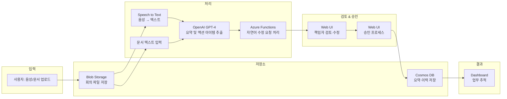

## ✅ Azure 기반 회의록 요약 및 업무 분배 AI 에이전트

### 📌 개요 및 목적

업무 회의에서 생성된 문서·음성 데이터를 AI가 자동으로 분석해 회의 내용을 요약하고, 액션 아이템별 담당자를 추천한 후 중간 책임자의 검토·승인을 거쳐 최종 할당까지 수행하는 협업 지원 시스템입니다.  
AI가 1차 안을 만들고 사람이 검토·수정함으로써 AI-Human 협업 기반 의사결정 및 실행 체계를 구현합니다.

---

## 🔧 환경 변수 설정

### 로컬 개발용
1. `.env.template` 파일을 `.env`로 복사
2. 실제 Azure 서비스 키 값들로 변경

### Azure Web App 배포용
환경 변수는 Azure Portal에서 설정해야 합니다:

1. **Azure Portal** > **Web App** > **Settings** > **Configuration**
2. **Application settings**에서 다음 환경 변수들을 추가:

```
AZURE_OPENAI_ENDPOINT=https://your-openai-resource.openai.azure.com/
AZURE_OPENAI_KEY=your_key_here
AZURE_OPENAI_DEPLOYMENT=gpt-4o-mini
AZURE_SPEECH_KEY=your_speech_key
AZURE_SPEECH_REGION=your_region
AZURE_BLOB_CONNECTION_STRING=your_connection_string
AZURE_SEARCH_ENDPOINT=https://your-search.search.windows.net
AZURE_SEARCH_ADMIN_KEY=your_search_key
COSMOS_ENDPOINT=https://your-cosmos.documents.azure.com:443/
COSMOS_KEY=your_cosmos_key
```

3. **General Settings**에서 시작 명령 설정:
   - **Startup Command**: `python main.py`

⚠️ **중요**: `.env` 파일은 절대 GitHub에 업로드하지 마세요!

---

### 🎯 주요 목표

- 음성·문서 기반 회의 내용 요약 자동화  
- 핵심 액션 아이템 추출 및 담당자 자동 추천  
- 책임자의 자연어 수정 요청·승인 기능  
- 승인 후 최종 담당자 할당 및 후속 진행 현황 트래킹  

---

### 🔧 핵심 활용 기술 및 Azure 서비스

- **Azure Speech to Text**  
  음성 녹음 파일의 텍스트 전환  

- **Azure OpenAI (GPT-4 series)**  
  회의 요약 및 액션 아이템 추출·자연어 수정 반영  

- **Azure Functions**  
  요약·추출 요청과 수정 요청 로직 처리  

- **Azure Blob Storage**  
  업로드된 음성·문서 파일 보관  

- **Azure Cosmos DB**  
  회의 요약본, 액션 아이템, 승인 이력 저장  

> 제외된 서비스는 데모 단계에서 모두 앱 내 더미·스텁으로 처리하고, 추후 확장 시점에 연동하십시오.

---

### 🧩 아키텍처



---

### 🎯 기대 효과

- 회의 요약 및 업무 정리 시간 90% 단축  
- 누락·오지정 리스크 감소 (검토·승인 단계 포함)  
- AI 초안 + 책임자 검토의 신뢰도 높은 실행 체계 구축  
- 팀원 협업 피로도 감소 및 업무 가시성 향상  
- 회의 후 후속 작업 실시간 트래킹 가능  

---

### ⚠️ 구현 시 고려사항

- 자연어 수정 요청의 문맥·의도 해석 정확도 확보  
- 승인자 역할 분리, 권한·워크플로우 정의  
- 수정 전·후 이력 관리(감사 로그)  
- 민감정보 자동 마스킹 및 내부 정책 위반 필터링  

---

### 🌱 고도화 방향

- Microsoft Teams·Outlook 그룹웨어와 실시간 연동  
- 발화자별 텍스트 분리 및 자동 책임자 매핑  
- 액션 아이템 완료율 기반 KPI 대시보드 연동  
- 조직별·주제별 요약 템플릿 자동 적용  
- Slack, Jira, MS Graph RBAC 시스템과 통합 API 개발
