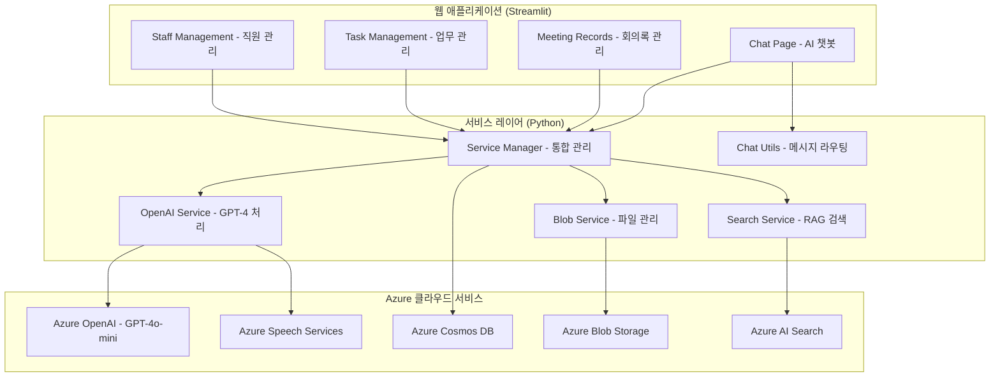

# ✅ Azure 기반 회의록 요약 및 업무 분배 AI 에이전트

## 📌 개요 및 목적
업무 회의 중 생성된 **문서/음성 데이터를 자동 분석**하여 회의 내용을 요약하고, **업무 항목별 담당자를 자동 추천**하며, **중간 책임자가 검토 및 승인 후 최종 할당**까지 할 수 있도록 하는 협업 지원 시스템입니다.

## 🎯 주요 목표
- 음성/문서 기반 회의내용 요약 자동화  
- 액션 아이템 추출 및 담당자 자동 추천  
- 책임자의 자연어 기반 수정 요청 및 승인 기능  
- 승인 후 최종 담당자 할당 및 후속 트래킹  

## 🔧 활용 기술 및 Azure 서비스
- **Azure Speech to Text**: 음성 인식 및 텍스트 전환 (한국어 지원)
- **Azure OpenAI (GPT-4o-mini)**: 텍스트 요약 및 액션 아이템 생성  
- **Azure Cosmos DB**: 회의록, 액션 아이템, 직원 정보, 채팅 히스토리 저장
- **Azure Blob Storage**: 회의 파일 저장 및 관리
- **Azure AI Search**: 회의록 및 직원 정보 검색 (RAG 시스템)

## 🧩 실제 구현된 시스템 아키텍처

## 🎯 기대 효과
- 회의 요약 및 업무 정리 시간 90% 이상 단축
- 업무 누락, 오지정 리스크 최소화 (검토/승인 단계 포함)
- AI 자동화 + 사람 검토의 신뢰도 높은 실행 체계
- 책임자와 팀원 모두의 협업 피로도 감소
- 회의 후 후속 작업 추적 가능성 ↑

## ⚠️ 구현 시 고려사항
- 민감정보 자동 마스킹 (주민번호, 전화번호, 이메일, 계좌번호)
- Azure 환경 변수 기반 보안 키 관리
- Cosmos DB 기반 감사 로그 및 승인 이력 추적
- Tenacity 라이브러리 기반 재시도 로직
- 구조화된 로깅 시스템 (일반/에러/구조화 로그)
- 예외 처리 및 에러 복구 메커니즘

## 🌱 고도화 방향
- Microsoft Teams, Outlook 등 그룹웨어와 통합
- 발화자별 회의 내용 분리 및 직원 정보 매핑  
- 액션 아이템 완료율 기반 KPI 연동
- 회의 주제·부서별 요약 템플릿 자동 적용
