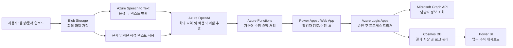

## ✅ Azure 기반 회의록 요약 및 업무 분배 AI 에이전트

### 📌 개요 및 목적
업무 회의 중 생성된 **문서/음성 데이터를 자동 분석**하여 회의 내용을 요약하고, **업무 항목별 담당자를 자동 추천**하며, **중간 책임자가 검토 및 승인 후 최종 할당**까지 할 수 있도록 하는 협업 지원 시스템입니다.
AI가 1차 초안을 생성하고, 사람(책임자)이 확인/수정함으로써 **AI-Human 협업 기반 의사결정 및 실행 체계**를 구축합니다.

### 🎯 주요 목표

- 음성/문서 기반 회의내용 요약 자동화
- 액션 아이템 추출 및 담당자 자동 추천
- 책임자의 자연어 기반 수정 요청 및 승인 기능
- 승인 후 최종 담당자 할당 및 후속 트래킹

### 🔧 활용 기술 및 Azure 서비스

- **Azure Speech to Text** : 음성 인식 및 텍스트 전환
- **Azure OpenAI (GPT-4 series)** : 텍스트 요약 및 액션 아이템 생성
- **Azure OpenAI + Azure Functions** : 자연어 기반 수정 요청 반영
- **Microsoft Graph API** : 사용자 및 조직 정보 연동
- **Azure Cosmos DB / Blob Storage** : 데이터 저장 및 버전 관리
- **Azure Logic Apps / Power Automate** : 책임자 승인 프로세스
- **Power Apps 또는 Web App (App Service)** : 프론트 UI 제공

### 🧩 아키텍처

### 🎯 기대 효과

- 회의 요약 및 업무 정리 시간 90% 이상 단축
- 업무 누락, 오지정 리스크 최소화 (검토/승인 단계 포함)
- AI 자동화 + 사람 검토의 신뢰도 높은 실행 체계
- 책임자와 팀원 모두의 협업 피로도 감소
- 회의 후 후속 작업 추적 가능성 ↑

### ⚠️ 구현 시 고려사항

- 자연어 기반 수정 요청 해석 정확도 확보 필요
- 승인자 역할 및 권한 체계 정의 필요
- 수정 전/후 이력 관리 (감사 목적 포함)
- 민감정보 및 내부 정책 위반 자동 필터링

### 🌱 고도화 방향

- Microsoft Teams, Outlook 등 그룹웨어와 통합
- 발화자별 회의 내용 분리 및 책임 자동 매핑
- 액션 아이템 완료율 기반 KPI 연동
- 회의 주제·부서별 요약 템플릿 자동 적용